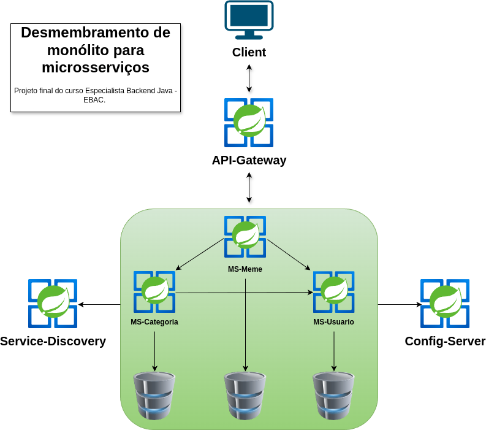

<div align="center">

 # Desmembramento de monólito para microsserviços

 ### Diagrama arquitetural do projeto

 

</div>
<hr>

## Descrição

O projeto consiste em migrar/desmembrar uma <a href="https://github.com/github-ebac/backend-java-pro/">aplicação monolítica</a> para uma arquitetura de microsserviços. 
O foco é identificar e definir os domínios, desenhar a nova arquitetura, e implementar monitoramento, logs, métricas e tracing distribuído. 
Além disso, será implementada a funcionalidade "meme do dia", que consiste em retornar um meme aleatório do banco de dados. 
O projeto também envolve a separação dos bancos de dados e o desacoplamento das entidades de domínio, mantendo seus relacionamentos. 
Registro de serviços e centralização de configurações são aspectos opcionais.

## Tecnologias e dependências do projeto

- **Spring Boot:** Base para a criação de microsserviços
- **Spring Cloud:** Ferramentas e libs para sistemas distribuídos
- **Spring Actuator:** Monitoramento e métricas
- **Spring Web:** Criação de API RESTful
- **Spring Cloud Config Server:** Centralização das configurações dos microsserviços
- **Spring Cloud Netflix Eureka Server:** Registro e descoberta de serviços
- **Spring Devtools:** Ferramentas adicionais para desenvolvimento
- **Spring Data JPA:** Abstração para acesso a dados
- **SpringDoc OpenApi WebMvc UI:** Documentação de API e teste de endpoints com Swagger UI
- **Spring Cloud OpenFeign:** Comunicação síncrona entre microsserviços
- **Spring Validation:** Validação de dados
- **Spring Bootstrap:** Inicialização do bootstrap.yml antes do contexto da aplicação
- **Micrometer Tracing Bridge Brave:** Tracing distribuído
- **Zipkin Reporter Brave:** Envio de tracings para o Zipkin
- **Lombok:** Redução de boilerplate de código
- **H2:** Banco de dados em memória

## Data Transfer Object (DTO)

O padrão dtos é para transferir dados entre partes de um sistema ou sistemas diferentes para reduzir trafego de dados e evitar expor informações sensíveis.
<hr>

## Testar o projeto

- Com docker e docker-compose instalados navegue até o diretório do projeto, abra seu terminal e digite o seguinte comando

```bash
docker-compose up -d 
```

- Inicie os microsserviços, começando pelo Config-Server, depois o Service-Discovery e, em seguida, os demais na ordem desejada. Essa ordem é importante, pois os microsserviços precisam acessar o Config-Server para obter as configurações centralizadas e se registrar no Service-Discovery para descoberta e comunicação.


- Os endpoints podem ser testados via Postman ou via OpenAPI (Swagger), que já está configurado como dependência do projeto. Utilize a porta 8890, que é a porta do API Gateway. Caso deseje testar via Postman, seguem abaixo os objetos JSON das entidades:

**Usuario:** Nome + E-mail(Deve ser válido pois possui validação via Spring Validations)
```json
{
  "nome": "Gab Dev",
  "email": "oliverbiel17051991@gmail.com"
}
```
